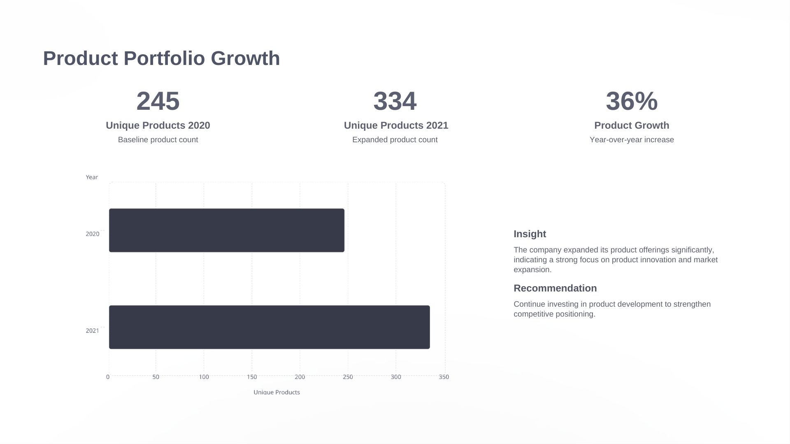
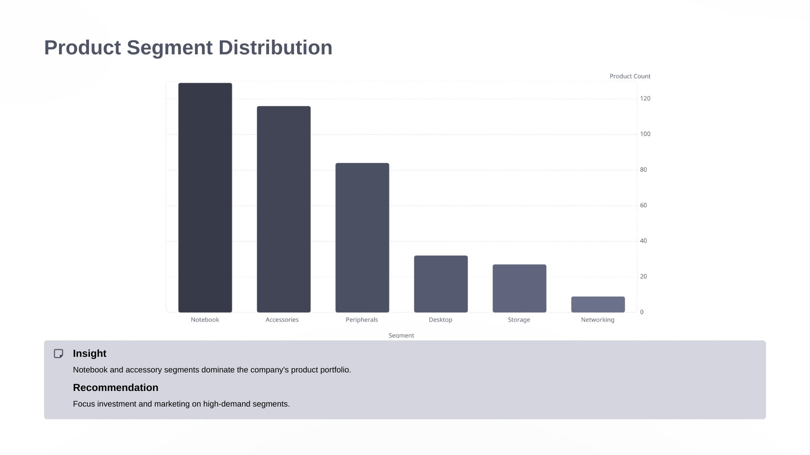
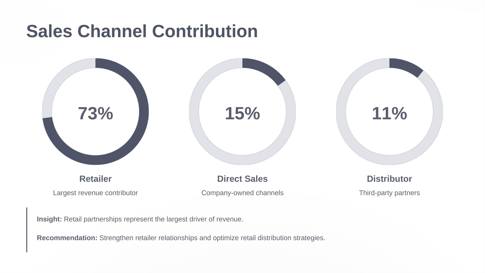

# Atliq Hardware Business Insights (SQL Project)

## Project Overview

This project analyzes business data for Atliq Hardware, a global computer hardware manufacturer, using SQL to generate actionable insights for management decision-making.

The analysis focuses on product growth, sales performance, customer behavior, and channel contribution.

This project was completed as part of the Codebasics SQL Resume Challenge.

---

## Business Problem

Atliq Hardware lacked quick access to meaningful insights from its operational database.

Key challenges included:

• Limited visibility into sales performance  
• Difficulty analyzing product portfolio growth  
• Lack of insights into customer discount strategies  
• Inability to identify high-performing sales channels  

The goal of this project is to solve these challenges using SQL-based analysis.

---

## Dataset Overview

The dataset consists of six main tables:

• dim_customer – customer details and market information  
• dim_product – product information and segment classification  
• fact_sales_monthly – monthly sales transactions  
• fact_gross_price – product pricing  
• fact_manufacturing_cost – product manufacturing cost  
• fact_pre_invoice_deductions – discount percentages  

---

## Tools Used

• SQL (MySQL)  
• Data Analysis  
• Business Intelligence  
• PowerPoint  
• GitHub  

---

## Key Business Questions

• Where does Atliq Exclusive operate in the APAC region?  
• How has the product portfolio grown from 2020 to 2021?  
• Which product segments dominate the portfolio?  
• Which customers receive the highest discounts?  
• Which quarter recorded the highest sales?  
• Which sales channel contributes the most revenue?  
• Which products perform best in each division?  

---

## Project Visuals

### Product Portfolio Growth


### Segment Distribution


### Channel Contribution


---

## Key Insights

• Product portfolio expanded by **36% (245 → 334 products)** from 2020 to 2021  
• Notebook and Accessories dominate the product portfolio  
• Retail channel contributes approximately **73% of total revenue**  
• Q4 recorded the highest sales performance  
• Major customers receive approximately **30% discounts**  

---

## Business Recommendations

• Focus on high-growth product segments  
• Optimize discount strategies to maintain profitability  
• Strengthen partnerships with retail distribution channels  
• Align inventory planning with seasonal demand trends  

---

## Sample SQL Query

```sql
SELECT segment, COUNT(DISTINCT product_code) AS product_count
FROM dim_product
GROUP BY segment
ORDER BY product_count DESC;

Project Deliverables

• SQL Queries → /SQL_Queries
• Presentation → /Presentation
• Visuals → /Images
• Dataset Info → /Dataset

Author

Anshul Chaudhary
Aspiring Data Analyst

Project Goal

This project demonstrates the ability to:

• Translate business problems into SQL queries
• Analyze relational datasets
• Generate actionable business insights
• Communicate findings to business stakeholders
